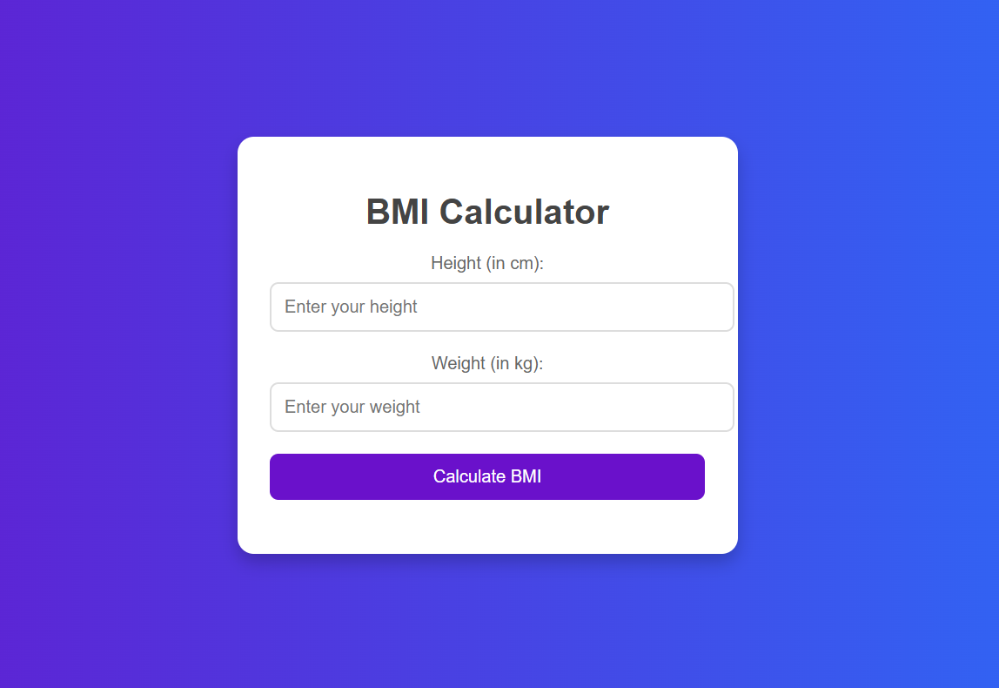

# BMI-Calculator

# BMI Calculator

A **BMI Calculator** is a tool used to calculate a person's **Body Mass Index (BMI)**. BMI is a numerical value derived from a person's height and weight and is commonly used as an indicator of body fatness. It helps determine whether an individual has a healthy body weight for their height.

## How It Works:

### Input:
- The user provides their **height** (in cm or meters).
- The user provides their **weight** (in kg or pounds).

### Formula:
BMI is calculated using the formula:

\[
BMI = \\frac{Weight\\ (kg)}{Height\\ (m)^2}
\]

### Output:
Based on the calculated BMI value, the user falls into one of the following categories:
- **Underweight:** BMI < 18.5
- **Normal weight:** BMI 18.5–24.9
- **Overweight:** BMI 25–29.9
- **Obesity:** BMI ≥ 30

### Notes:
This tool is widely used for general health assessments. However, it does not account for factors such as:
- Muscle mass
- Bone density
- Fat distribution

---

Feel free to clone the repository and customize the BMI Calculator as per your needs!

**Visit the link:-** https://pintu1238.github.io/BMI-Calculator/

